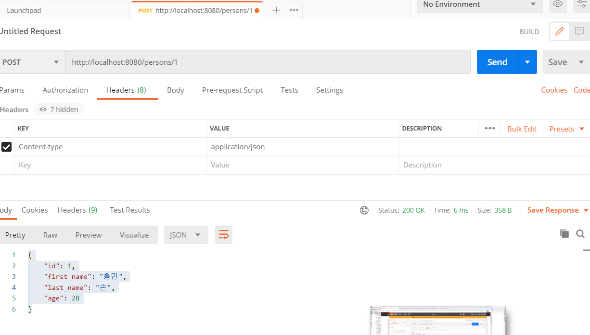
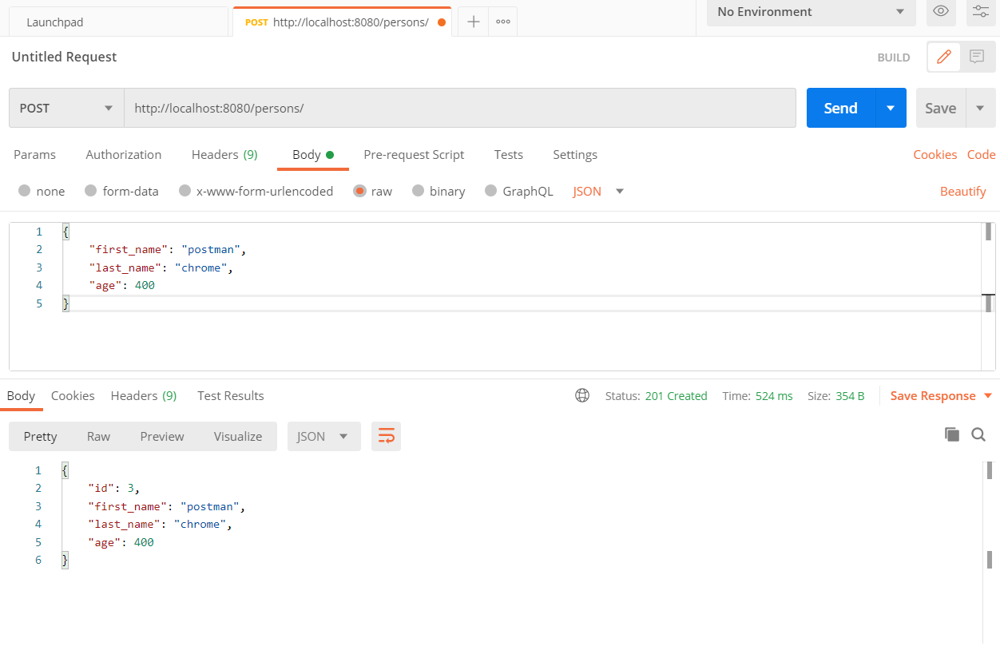
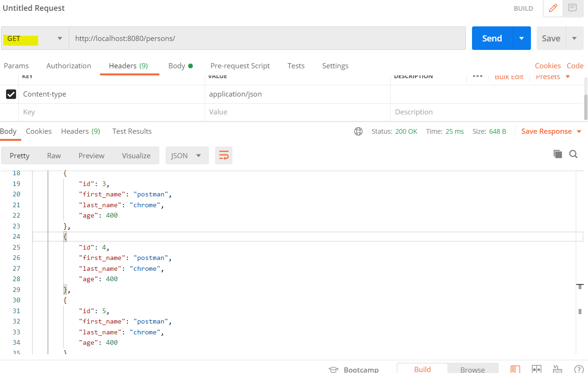

# django_rest_fw 실습

username: rest, 

password: rest

장고 REST 프레임워크 

https://www.django-rest-framework.org/

튜토리얼(좀더 쉬운버전)[★본 코드는 이걸 참고함↓↓↓↓↓↓↓↓↓↓]

https://www.django-rest-framework.org/tutorial/quickstart/

``````terminal
C:\mypython\django_rest_fw>django-admin startproject mydjango_rest .
C:\mypython\django_rest_fw>python manage.py startapp person
------------------------------------------------------------------


[mydjango_rest/settings.py 밑에 코드 추가 저장]

INSTALLED_APPS = [
	
	'rest_framework',
	'person',
  ]
REST_FRAMEWORK = {
    'DEFAULT_PAGINATION_CLASS': 'rest_framework.pagination.PageNumberPagination',
    'PAGE_SIZE': 10
}


------------------------------------------------------------------
C:\mypython\django_rest_fw>python manage.py migrate
C:\mypython\django_rest_fw>python manage.py runserver 8080
새 터미널 켜고
(base) C:\mypython\django_rest_fw>python manage.py createsuperuser
Username (leave blank to use 'jin'): rest
Email address: aa@aa.com
Password:
Password (again):
The password is too similar to the username.
This password is too short. It must contain at least 8 characters.
Bypass password validation and create user anyway? [y/N]: y
Superuser created successfully.
---------------------------------------------------------


[person/models.py 초기작성]
from django.db import models

class Person(models.Model):
    first_name = models.CharField(max_length=50)
    last_name = models.CharField(max_length=50)
	age = models.IntegerField()
	
	
----------------------------------------------------------    
(base) C:\mypython\django_rest_fw>python manage.py makemigrations person
(base) C:\mypython\django_rest_fw>python manage.py migrate person
--------------------------------------------------------


[person/admin.py 초기작성]
from django.contrib import admin
from. models import Person

admin.site.register(Person)
->http://127.0.0.1:8080/admin/ 페이지에 person 생겼는지 확인후 addperson


[person/serializers.py 생성 후 밑에 코드 초기작성]
from .models import Person
from rest_framework import serializers

class PersonSerializers(serializers.HyperlinkedModelSerializer):
    class Meta:
        model = Person
        fields = ('id', 'first_name', 'last_name', 'age')


[person/views.py 초기작성]
from django.shortcuts import render
from rest_framework import viewsets
from .models import Person
from .serializers import PersonSerializers

class PersonViewSet(viewsets.ModelViewSet):
    queryset = Person.objects.all()
    serializer_class = PersonSerializers
    
    
[person/urls.py 파일 생성 후 밑에 코드 초기작성]
from django.urls import include, path
from rest_framework import routers
from person import views

router = routers.DefaultRouter()
router.register(r'persons', views.PersonViewSet)

urlpatterns = [
    path('', include(router.urls)),
    path('api-auth/', include('rest_framework.urls', namespace='rest_framework'))
]

-> 런서버 하고 확인 Api Root가 뜰거임
http://127.0.0.1:8080/persons/  :persons도 확인 
``````

POSTMAN



2



3




전체목록조회 GET http://localhost:8080/persons
 1개 조회 GET http://localhost:8080/persons/1
 등록 POST http://localhost:8080/persons/  ( / 슬래쉬 꼭)
   header  content-type  application/json
   body     raw
   {
     "first_name": "postman",
     "last_name": "chrome",
     "age": 440
    }
 수정 PUT http://localhost:8080/persons/4/  ( / 슬래쉬 꼭)
   header  content-type  application/json
   body     raw
   {
     "first_name": "postman22",
     "last_name": "chrome22",
     "age": 44022
    }
  삭제 DELETE
    전체삭제
    http://localhost:8080/persons/  ( / 슬래쉬 꼭)
    1건 삭제
    http://localhost:8080/persons/4/    ( / 슬래쉬 꼭)